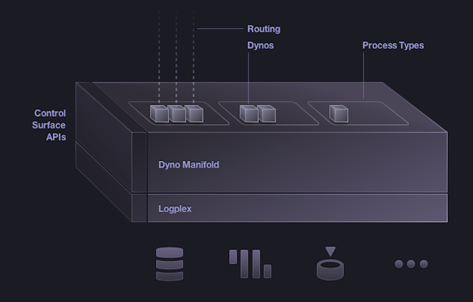

<!SLIDE whats-in-store incremental>

# Introducing the Cloud

* SaaS
* IaaS
* PaaS

<!SLIDE introducing-heroku>

# Introducing Heroku

<!SLIDE incremental how-it-works>

# PaaS

* HTTP Routing / Load Balancing
* Elastic Polyglot Runtime
* Management & Logging
* Component as a Service Ecosystem

<!SLIDE more-awesome>

# Let developers do more awesome

<!SLIDE center how-it-works>

<!SLIDE commandline incremental run-anything>

# Instant App Creation

    $ heroku create --stack cedar

